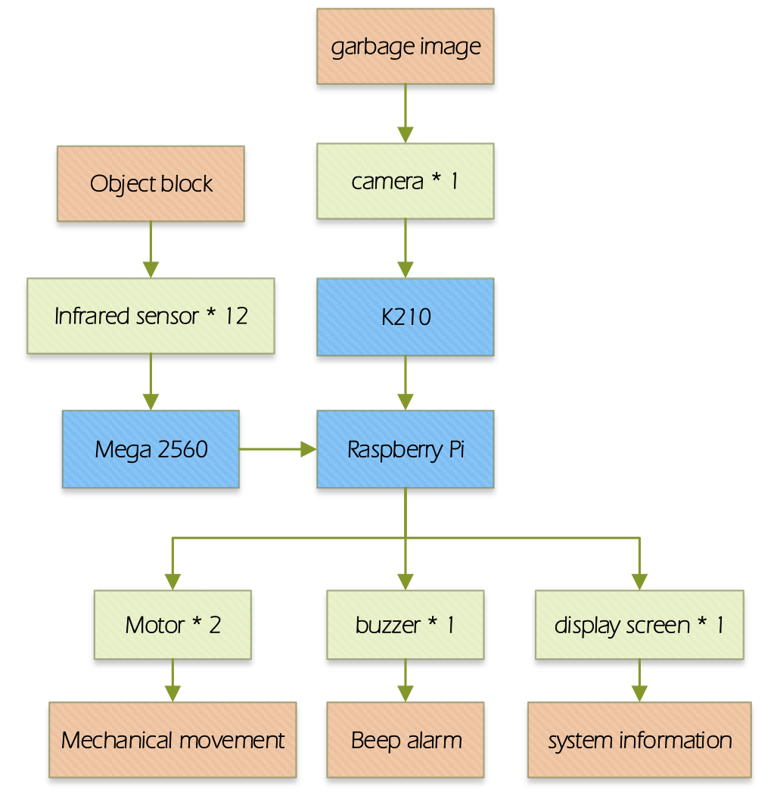
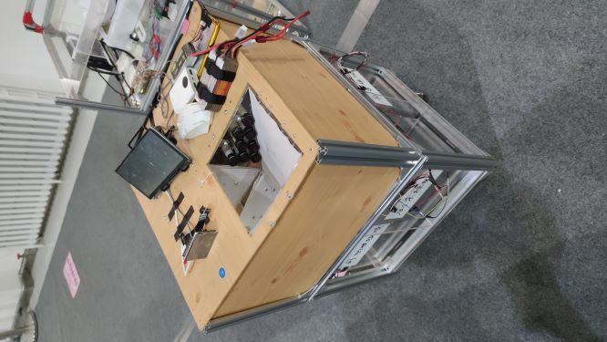
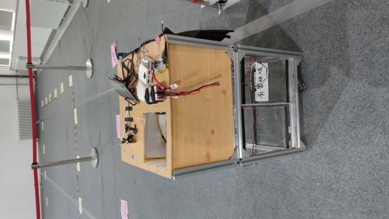
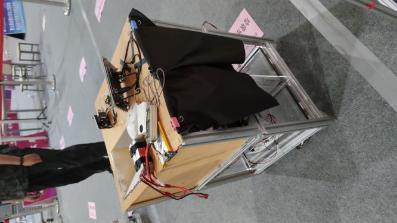
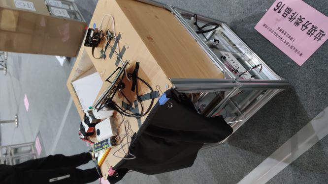

目录说明：

K210：K210内存卡中全部内容，包含模型和代码，拷入SD卡可以直接使用
Mega2560：mega2560的全部代码
TrashProject_final：树莓派上全部代码
trash_k210_train：包含识别模型训练的全部代码以及训练数据

<table>
    <tr>
    	<td></td>
        <td></td>
    </tr><tr>
    	<td></td>
        <td></td>
    </tr>
</table>

