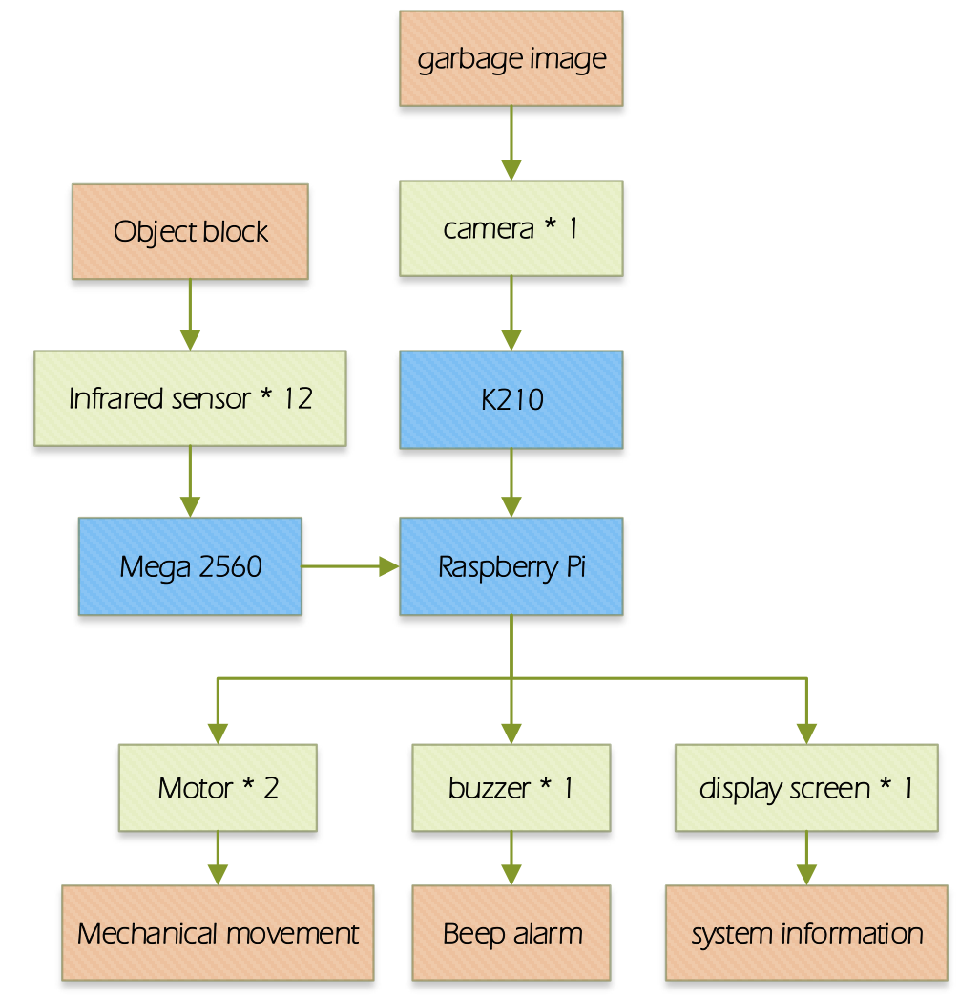
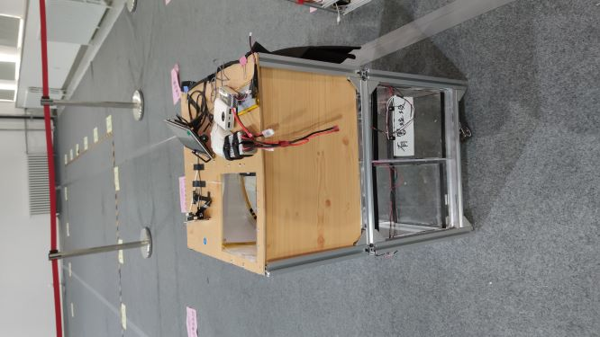
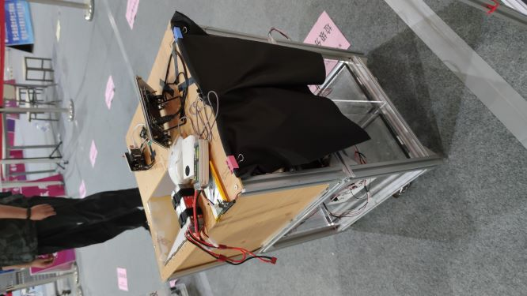
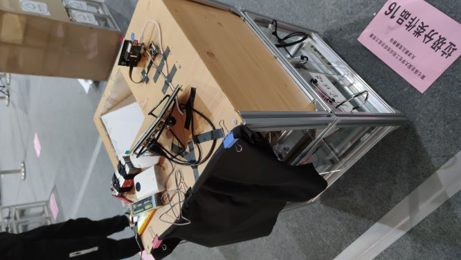

目录说明：

- K210：K210内存卡中全部内容，包含模型和代码，拷入SD卡可以直接使用
- Mega2560：mega2560部署的代码
- RaspberryPi：树莓派部署的代码
- Classifier_Train：识别模型训练的代码

<table>
    <tr>
    	<td></td>
        <td></td>
    </tr><tr>
    	<td></td>
        <td></td>
    </tr>
</table>

